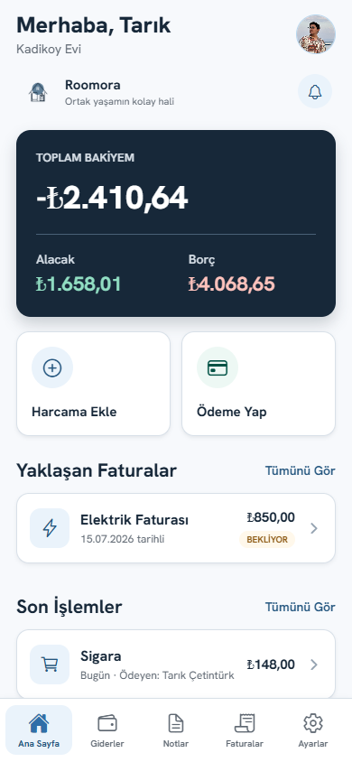
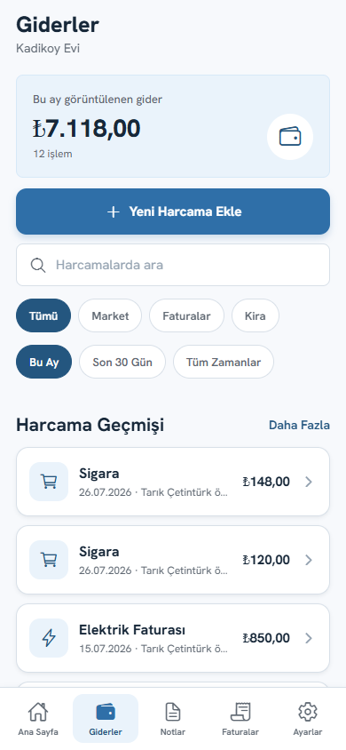
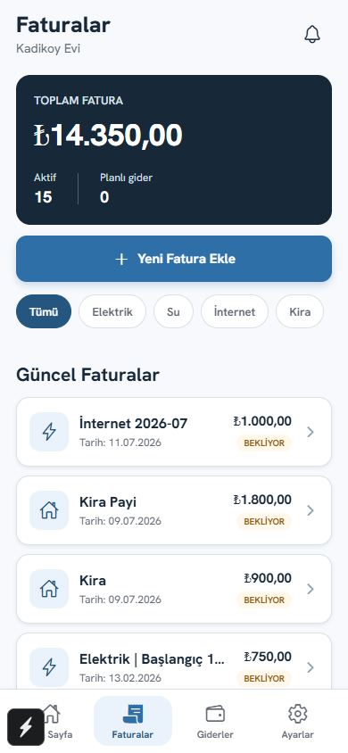

# Roomora Mobile

Mobil build, TestFlight, Google Play Internal Testing, OTA ve sürüm yükseltme
akışı için [Mobil Sürüm Akışı](docs/MOBILE_RELEASE_FLOW.md) belgesine bakın.

Roomora, ev arkadaşlarının ortak harcamaları, faturaları, notları ve ödemeleri tek yerde yönetmesini sağlayan Expo tabanlı mobil uygulamadır.

> Ortak yaşamın kolay hali.

## Uygulama

| Ana Sayfa | Giderler | Faturalar |
| --- | --- | --- |
|  |  |  |

## Öne Çıkanlar

- Hızlı ortak harcama ve kişisel kalem girişi
- Üye bazlı borç, alacak ve kısmi ödeme takibi
- Fatura, kira, düzenli gider ve kalan taksit planları
- Paylaşımlı alışveriş ve ev notları
- Fiş tarama ve manuel düzeltme akışı
- Kalıcı favori ev, profil ve ev fotoğrafı
- Açık/koyu tema ve Türkçe/İngilizce dil altyapısı

## Yerel Çalıştırma

```bash
npm install
npm start
```

Telefon ve bilgisayar aynı ağdayken Expo Go ile terminaldeki QR kodu okutun. API varsayılan olarak yerel ağdaki `5118` portunu kullanır; adresi `.env` veya `app.json` üzerinden yapılandırın.

```bash
npm test
npm run web:build
npm run export:android
npm run export:ios
```

## Yapı

- `App.js`: Navigation ve provider yapısı
- `src/screens`: Ürün ekranları
- `src/services/api.js`: Backend istemcisi
- `src/context/AuthContext.js`: Oturum ve favori ev
- `src/shared/theme`: Roomora tasarım sistemi
- `docs/store`: App Store ve Google Play hazırlıkları

## Bağlı Projeler

- Roomora Backend: ASP.NET Core API
- Roomora Web: Web istemcisi
- Roomora OCR: Fiş okuma servisi

Üretim paketinden önce [yayın kontrol listesini](docs/store/RELEASE_CHECKLIST.md) tamamlayın.
